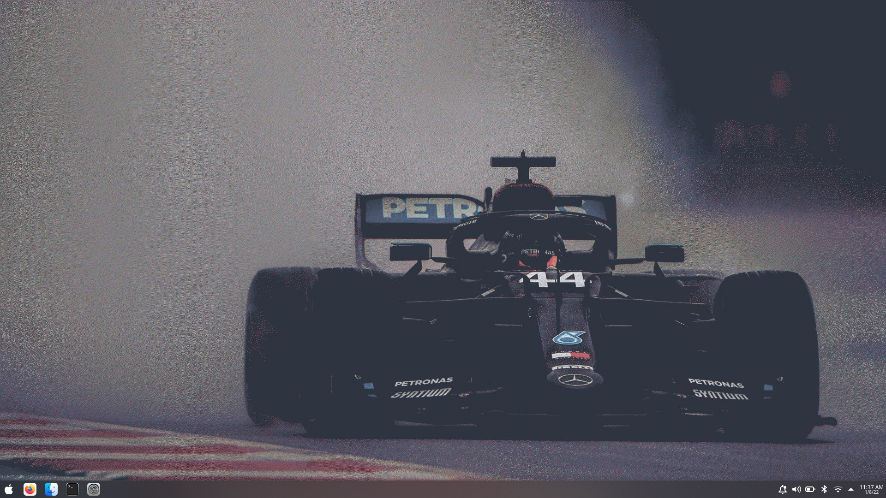

# dotfiles

## Screenshots




## Stuff to install on new machine

- **yay**

```bash
sudo pacman -S --needed git base-devel
git clone https://aur.archlinux.org/yay.git
cd yay
makepkg -si
```

- **zsh-plugins** (install `oh-my-zsh` first)

```bash
git clone --depth=1 https://github.com/romkatv/powerlevel10k.git ${ZSH_CUSTOM:-$HOME/.oh-my-zsh/custom}/themes/powerlevel10k\n
git clone https://github.com/zsh-users/zsh-autosuggestions ${ZSH_CUSTOM:-~/.oh-my-zsh/custom}/plugins/zsh-autosuggestions
git clone https://github.com/zsh-users/zsh-syntax-highlighting.git ${ZSH_CUSTOM:-~/.oh-my-zsh/custom}/plugins/zsh-syntax-highlighting
sudo pacman -S autojump
```

- **vim-plug**

```bash
curl -fLo ~/.vim/autoload/plug.vim --create-dirs \\n    https://raw.githubusercontent.com/junegunn/vim-plug/master/plug.vim
sudo pacman -S nodejs npm
```

- **coc plugins**

  - coc-pyright
  - coc-yaml
  - coc-json

- **i3**

```bash
sudo pacman -S i3-wm kitty
yay -S polybar
```
